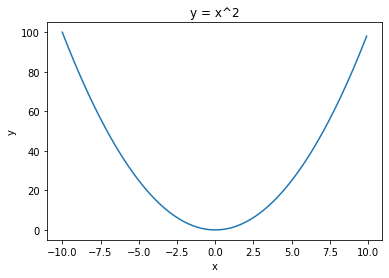
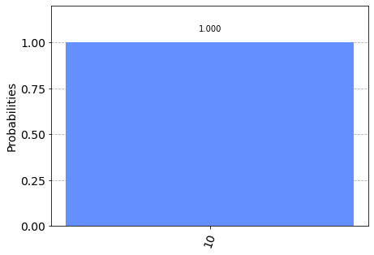

```python
%matplotlib inline

# Importing standard Qiskit libraries and configuring account
from qiskit import QuantumCircuit, execute, Aer, IBMQ
from qiskit.compiler import transpile, assemble
from qiskit.tools.jupyter import *
from qiskit.visualization import *

# Loading your IBM Q account(s)
provider = IBMQ.load_account()

import matplotlib.pyplot as plt
import numpy as np

# custom code
import context
from device_independent_test import example
```


```python
example.hello()
example.add_two(-3)
```

    hello


    -1


```python
x_series = np.arange(-10,10,0.1)
y_series = map(example.parabola, x_series)


plt.plot(list(x_series), list(y_series))
plt.xlabel("x")
plt.ylabel("y")
plt.title("y = x^2");

```





```python
prepare_circuit = example.prepare_01_circuit()
prepare_circuit.draw()
```


<pre style="word-wrap: normal;white-space: pre;background: #fff0;line-height: 1.1;font-family: &quot;Courier New&quot;,Courier,monospace">          
q_0: ─────
     ┌───┐
q_1: ┤ X ├
     └───┘</pre>


```python
from qiskit.quantum_info import Statevector

statevector = Statevector.from_instruction(prepare_circuit)
print(statevector.data)
```

    [0.+0.j 0.+0.j 1.+0.j 0.+0.j]


```python
measure_circuit = example.measure_circuit(2)
measure_circuit.draw()
```


<pre style="word-wrap: normal;white-space: pre;background: #fff0;line-height: 1.1;font-family: &quot;Courier New&quot;,Courier,monospace">         ░ ┌─┐   
   q_0: ─░─┤M├───
         ░ └╥┘┌─┐
   q_1: ─░──╫─┤M├
         ░  ║ └╥┘
meas_0: ════╩══╬═
               ║ 
meas_1: ═══════╩═
                 </pre>


```python
prepare_measure_circuit = prepare_circuit + measure_circuit
prepare_measure_circuit.draw()
```


<pre style="word-wrap: normal;white-space: pre;background: #fff0;line-height: 1.1;font-family: &quot;Courier New&quot;,Courier,monospace">              ░ ┌─┐   
   q_0: ──────░─┤M├───
        ┌───┐ ░ └╥┘┌─┐
   q_1: ┤ X ├─░──╫─┤M├
        └───┘ ░  ║ └╥┘
meas_0: ═════════╩══╬═
                    ║ 
meas_1: ════════════╩═
                      </pre>


```python
provider.backends()
```


    [<IBMQSimulator('ibmq_qasm_simulator') from IBMQ(hub='ibm-q', group='open', project='main')>,
     <IBMQBackend('ibmqx2') from IBMQ(hub='ibm-q', group='open', project='main')>,
     <IBMQBackend('ibmq_16_melbourne') from IBMQ(hub='ibm-q', group='open', project='main')>,
     <IBMQBackend('ibmq_vigo') from IBMQ(hub='ibm-q', group='open', project='main')>,
     <IBMQBackend('ibmq_ourense') from IBMQ(hub='ibm-q', group='open', project='main')>,
     <IBMQBackend('ibmq_london') from IBMQ(hub='ibm-q', group='open', project='main')>,
     <IBMQBackend('ibmq_burlington') from IBMQ(hub='ibm-q', group='open', project='main')>,
     <IBMQBackend('ibmq_essex') from IBMQ(hub='ibm-q', group='open', project='main')>,
     <IBMQBackend('ibmq_armonk') from IBMQ(hub='ibm-q', group='open', project='main')>,
     <IBMQBackend('ibmq_rome') from IBMQ(hub='ibm-q', group='open', project='main')>]


```python
quantum_system = provider.get_backend("ibmq_qasm_simulator")

job = execute(prepare_measure_circuit, backend=quantum_system, shots=1000)
from qiskit.tools.monitor import *
job_monitor(job)
```

    Job Status: job has successfully run


```python
counts = job.result().get_counts(prepare_measure_circuit)
plot_histogram(counts)
```





```python

```
